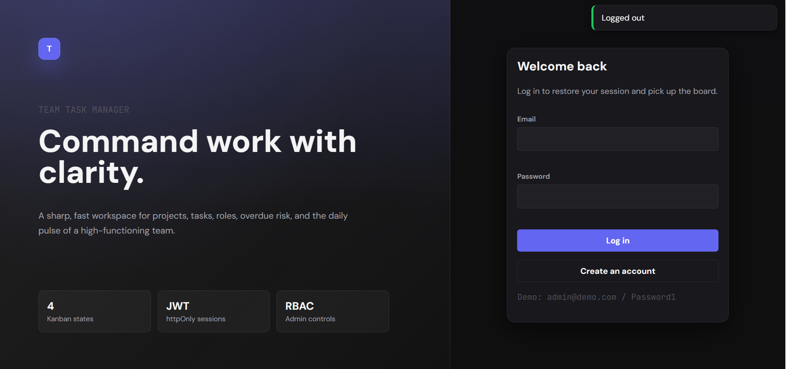
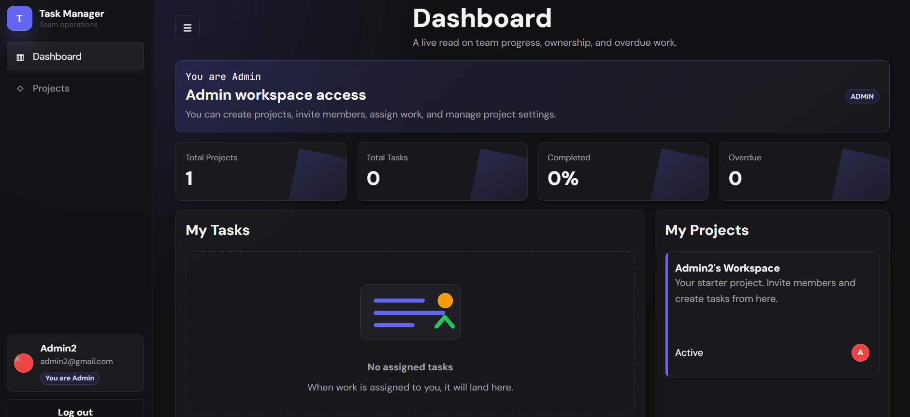
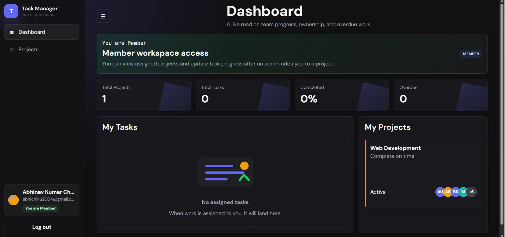
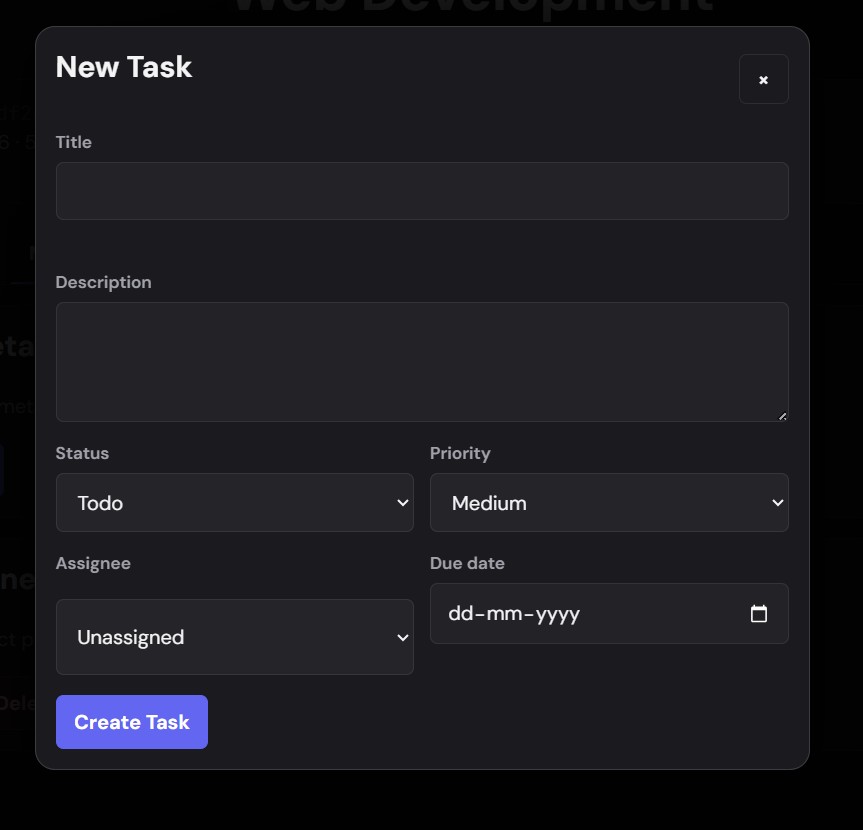
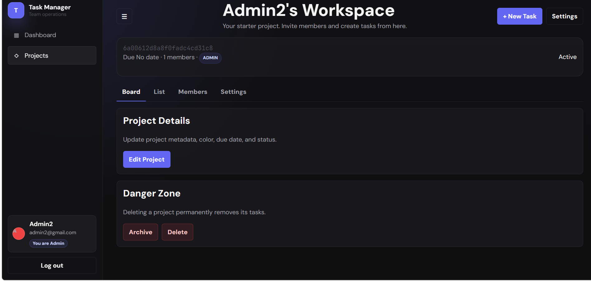
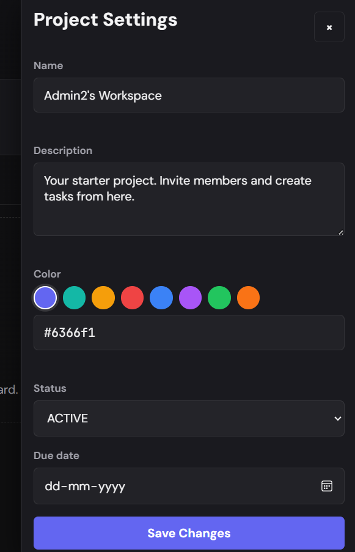

# Team Task Manager

A production-ready full-stack Team Task Manager built with Node.js, Express, MongoDB, Mongoose, JWT authentication, and a zero-build vanilla JavaScript frontend. The UI is dark-mode-first with a premium SaaS dashboard style, project workspaces, Kanban boards, list views, role-based access, and Railway deployment support.

## Live Demo

Railway URL:

```text
https://team-task-manager-production-e25f.up.railway.app
```

Health check:

```text
https://team-task-manager-production-e25f.up.railway.app/api/health
```

Expected response:

```json
{
  "status": "ok",
  "db": "connected",
  "timestamp": "2026-05-10T00:00:00.000Z"
}
```

## Demo Accounts

After running `npm run seed`, use these accounts:

| Name | Email | Password | Account Type |
| --- | --- | --- | --- |
| Admin User | `admin@demo.com` | `Password1` | ADMIN |
| Alice Chen | `alice@demo.com` | `Password1` | MEMBER |
| Bob Smith | `bob@demo.com` | `Password1` | MEMBER |

## Features

- Secure signup, login, logout, and session restore
- JWT access token stored in an httpOnly cookie
- Password hashing with `bcryptjs` cost factor 12
- Account type selection during signup: ADMIN or MEMBER
- ADMIN signup automatically creates a starter workspace project
- Clear in-app role indicator: "You are Admin" or "You are Member"
- Project-based role access control with ADMIN and MEMBER permissions
- Dashboard with total projects, total tasks, completion percentage, overdue tasks, and active members
- Project cards with color, status, member avatars, and task progress
- Project detail page with Board, List, Members, and Settings tabs
- Kanban board with drag-and-drop status updates
- Optimistic UI updates for Kanban movement
- Task list table with sorting and filters
- Task modal with inline editing
- Priority badges and status badges
- Overdue task highlighting
- Member management for admins
- Searchable member picker by name or email
- Multi-member add flow from search results
- Role changes and member removal
- Project settings, archive, and delete controls for admins
- Empty states for projects, tasks, and members
- Toast notifications for success and error states
- Responsive layout for mobile and desktop
- Dockerfile and `railway.json` for Railway deployment

## Tech Stack

| Layer | Technology |
| --- | --- |
| Runtime | Node.js |
| Backend | Express.js |
| Database | MongoDB |
| ODM | Mongoose |
| Auth | JWT, bcryptjs, httpOnly cookies |
| Frontend | Vanilla JavaScript, HTML, CSS |
| Styling | Custom CSS variables |
| Deployment | Railway, Docker |

## Project Structure

```text
/
|-- src/
|   |-- models/
|   |   |-- User.js
|   |   |-- Project.js
|   |   `-- Task.js
|   |-- middleware/
|   |   |-- auth.js
|   |   `-- roles.js
|   |-- routes/
|   |   |-- auth.js
|   |   |-- projects.js
|   |   |-- tasks.js
|   |   |-- members.js
|   |   `-- dashboard.js
|   |-- controllers/
|   |   |-- authController.js
|   |   |-- projectController.js
|   |   |-- taskController.js
|   |   |-- memberController.js
|   |   `-- dashboardController.js
|   |-- utils/
|   |   |-- db.js
|   |   `-- seed.js
|   `-- app.js
|-- public/
|   |-- index.html
|   |-- css/
|   |   |-- main.css
|   |   |-- components.css
|   |   `-- layout.css
|   `-- js/
|       |-- api.js
|       |-- router.js
|       |-- auth.js
|       |-- dashboard.js
|       |-- projects.js
|       |-- tasks.js
|       `-- members.js
|-- screenshots/
|-- server.js
|-- package.json
|-- package-lock.json
|-- .env.example
|-- Dockerfile
|-- railway.json
`-- README.md
```

## Environment Variables

Create a `.env` file locally:

```env
MONGODB_URI=mongodb+srv://<user>:<password>@cluster0.xxxxx.mongodb.net/team-task-manager?retryWrites=true&w=majority
JWT_SECRET=replace_with_a_long_random_secret_at_least_64_chars
NODE_ENV=development
PORT=3000
```

For Railway, add these in the service Variables tab:

```env
MONGODB_URI=mongodb+srv://<user>:<password>@cluster0.xxxxx.mongodb.net/team-task-manager?retryWrites=true&w=majority
JWT_SECRET=replace_with_a_long_random_secret_at_least_64_chars
NODE_ENV=production
```

Important: `.env` is ignored by Git and should not be uploaded.

## Local Setup

```bash
git clone https://github.com/aabhinav2004/team-task-manager.git
cd team-task-manager
npm install
cp .env.example .env
npm run seed
npm start
```

Open:

```text
http://127.0.0.1:3000
```

Development mode with auto-restart:

```bash
npm run dev
```

## Seed Data

Run:

```bash
npm run seed
```

The seed script clears and recreates:

- 3 demo users
- 2 demo projects
- 10 demo tasks
- Tasks across Todo, In Progress, In Review, and Done
- Overdue tasks for dashboard testing

## User Roles

Roles are project-based.

### ADMIN

Admins can:

- Create projects
- Edit project settings
- Archive projects
- Delete projects
- Add members
- Add multiple members from searchable user results
- Remove members
- Change member roles
- Create tasks
- Edit all task fields
- Delete tasks
- Assign tasks to project members

### MEMBER

Members can:

- View projects they belong to
- View members
- Create tasks inside their projects
- View assigned work
- Update status on their assigned tasks

Members cannot:

- Delete projects
- Archive projects
- Change project settings
- Add or remove members
- Change member roles
- Delete tasks

## Application Flow

1. A user signs up as ADMIN or MEMBER.
2. ADMIN signup creates a starter workspace automatically.
3. MEMBER signup creates an account but no project access by default.
4. Admin opens a project and goes to the Members tab.
5. Admin searches users by name or email.
6. Admin selects one or more users and adds them to the project.
7. Members can now log in and access that project.
8. Tasks can be created, assigned, filtered, edited, and moved across Kanban columns.

## API Reference

### Auth

| Method | Endpoint | Auth | Description |
| --- | --- | --- | --- |
| POST | `/api/auth/signup` | No | Create account and auto-login |
| POST | `/api/auth/login` | No | Login and set httpOnly cookie |
| POST | `/api/auth/logout` | Yes | Clear cookie |
| GET | `/api/auth/me` | Yes | Return current user |

### Dashboard

| Method | Endpoint | Auth | Description |
| --- | --- | --- | --- |
| GET | `/api/dashboard/stats` | Yes | Aggregated dashboard stats, my tasks, projects, recent activity |

### Projects

| Method | Endpoint | Auth | Role | Description |
| --- | --- | --- | --- | --- |
| GET | `/api/projects` | Yes | Member | List projects for current user |
| POST | `/api/projects` | Yes | User | Create project |
| GET | `/api/projects/:id` | Yes | Member | Project detail with members and counts |
| PATCH | `/api/projects/:id` | Yes | ADMIN | Update project |
| DELETE | `/api/projects/:id` | Yes | ADMIN | Delete project and cascade delete tasks |

### Tasks

| Method | Endpoint | Auth | Role | Description |
| --- | --- | --- | --- | --- |
| GET | `/api/projects/:projectId/tasks` | Yes | Member | List project tasks |
| POST | `/api/projects/:projectId/tasks` | Yes | Member | Create task |
| GET | `/api/projects/:projectId/tasks/:taskId` | Yes | Member | Get task detail |
| PATCH | `/api/projects/:projectId/tasks/:taskId` | Yes | ADMIN, creator, or assignee | Update task |
| DELETE | `/api/projects/:projectId/tasks/:taskId` | Yes | ADMIN | Delete task |

Task update rule:

- ADMIN and creator can edit all fields.
- Assignee can update status only.

### Members

| Method | Endpoint | Auth | Role | Description |
| --- | --- | --- | --- | --- |
| GET | `/api/projects/:projectId/members` | Yes | Member | List project members |
| GET | `/api/projects/:projectId/members/candidates?search=name` | Yes | ADMIN | Search users not already in project |
| POST | `/api/projects/:projectId/members` | Yes | ADMIN | Add one or more members |
| PATCH | `/api/projects/:projectId/members/:userId` | Yes | ADMIN | Change member role |
| DELETE | `/api/projects/:projectId/members/:userId` | Yes | ADMIN | Remove member |

Multiple member add body:

```json
{
  "userIds": ["USER_ID_1", "USER_ID_2"],
  "role": "MEMBER"
}
```

### Health

| Method | Endpoint | Auth | Description |
| --- | --- | --- | --- |
| GET | `/api/health` | No | App and database health |

## Validation Rules

Signup:

- Name: 2-50 characters
- Email: valid email
- Password: minimum 8 characters, 1 uppercase letter, 1 number
- Account type: ADMIN or MEMBER

Project:

- Name: 2-100 characters
- Color: valid 6-digit hex value
- Description: maximum 500 characters

Task:

- Title: 1-200 characters
- Description: maximum 2000 characters
- Status: TODO, IN_PROGRESS, IN_REVIEW, DONE
- Priority: LOW, MEDIUM, HIGH, URGENT
- Due date must be a valid future date

## Railway Deployment

1. Push this project to GitHub.
2. Open Railway.
3. Create a new project.
4. Choose Deploy from GitHub repo.
5. Select this repository.
6. Railway will build using the included `Dockerfile`.
7. Add environment variables in the Railway service Variables tab.
8. Generate a public domain from service Settings.
9. Open `/api/health` to confirm MongoDB is connected.

Required Railway variables:

```env
MONGODB_URI=your_mongodb_uri
JWT_SECRET=your_long_secret
NODE_ENV=production
```

If using MongoDB Atlas, add this to Atlas Network Access:

```text
0.0.0.0/0
```

This allows Railway to connect to the Atlas cluster.

## Docker

Build locally:

```bash
docker build -t team-task-manager .
```

Run locally:

```bash
docker run -p 3000:3000 --env-file .env team-task-manager
```

## Screenshots




.png)




## Security Notes

- Passwords are never stored as plain text.
- JWT is stored in an httpOnly cookie.
- `.env` is ignored by Git.
- Project access is checked server-side.
- Admin-only actions are protected by role middleware.
- Invalid ObjectIds are rejected before database operations.
- Duplicate emails return a conflict response.

## Troubleshooting

### Railway deployment succeeds but healthcheck fails

Check Railway Variables:

```env
MONGODB_URI=...
JWT_SECRET=...
NODE_ENV=production
```

If using Atlas, check Network Access and allow:

```text
0.0.0.0/0
```

### Port 3000 already in use locally

PowerShell:

```powershell
netstat -ano | findstr :3000
Stop-Process -Id <PID>
```

Then restart:

```powershell
npm start
```

### Git line ending warnings on Windows

This repo includes `.gitattributes`. The warnings are usually harmless.

## License

This project is ready for personal, portfolio, and learning use.
